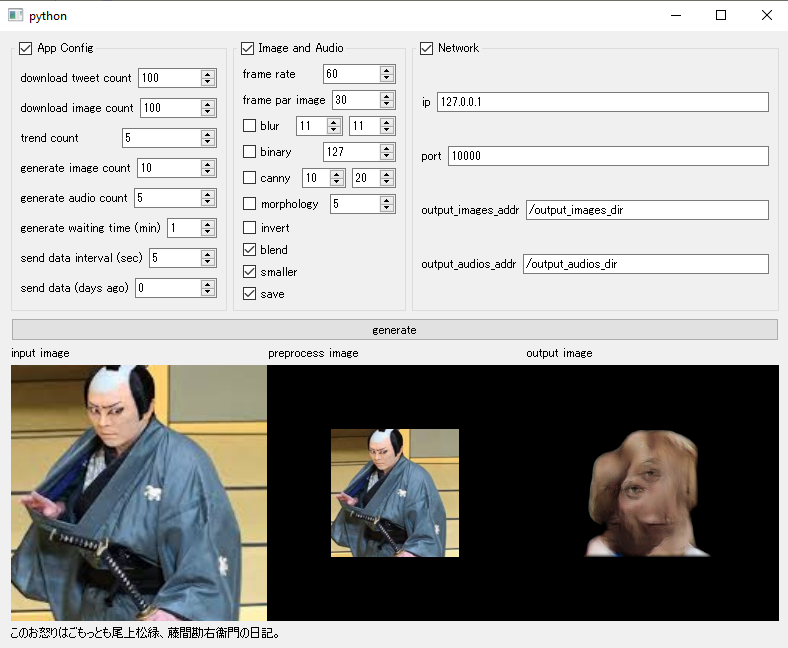

# Shadow App

## 環境構築
Anaconda（Miniconda）をインストールしてください。

その後、下記コマンドを実行することで、  
Anacondaでshadowという名前の環境が作られ、`keras-contrib`がインストールされます。
```
$ conda env create -n shadow -f env.yml
$ pip install git+https://www.github.com/keras-team/keras-contrib.git
```

## アプリの実行

アプリを実行するには、まず環境を`shadow`に切り替えてください。
```
$ conda activate shadow
```
切り替わったことが確認できたら、プロジェクトのルートディレクトリに移動します。

```
$ cd C:\path\to\shadow
```

以下のコマンドで実行完了です。
```
$ python main.py
```

## 送信データ
プロトコルはOSCを使用しています。  
生成した`.jpg`、`.wav`が格納させた2つのディレクトリパスを、それぞれ該当するアドレスに送信します。


| port | address       | type   | msg                   |
| ---- | ------------- | ------ | --------------------- |
| 10000 | /output_images_dir | string | "C:\path\to\output_images" |
| 10000 | /output_audios_dir | string | "C:\path\to\output_audios" |

GUIウィンドウからも変更することが出来ます。

## 保存データ
dataディレクトリ配下にリソースを保存します。
- input_images
  - トレンドで検索しダウンロードした画像データ。jpgファイル
- input_text
  - トレンドで検索しダウンロードしたTweetテキスト。txtファイル
- lstm_models
  - トレンドのTweetテキストから生成したLSTMモデル。h5ファイル
- output_audios
  - トレンドのTweetテキストから生成した音声データ。wavファイル
- output_images
  - トレンド画像から生成した画像。jpgファイル

## GUIウィンドウ


### App Config
- download tweet count
  - ダウンロードするツイート数
- download image count
  - 設定した数だけ画像をダウンロードする
- trend count
  - トレンドワードのリミット数を設定する
- generate image count
  - 画像の生成に用いる画像の枚数
- generate audio count
  - 設定した数だけオーディオデータを生成する
- generate waiting time(min)
  - トレンドワードが一巡したあと、設定した時間だけ待機状態になる
- send data interval(sec)
  - 設定した時間毎にOSCで送信する
- send data(days ago)

### Image and Audio
- frame rate
  - 生成画像のフレームレートを設定する
- frame par iamge
  - 画像一枚あたりのフレーム数
- blur
  - ブラー処理
- binary
  - 二値化（白黒）処理
- canny
  - 輪郭検出処理
- morphology
  - 黒の面積を膨張させる
- invert
  - 色の反転
- blend
  - 画像をフェードで切り替える
- smaller
  - 画像のサイズを中央に小さく表示する
- save
  - 画像とオーディオを保存する
  
### Network
- ip
  - 送信先のIPを設定する
- port
  - 送信先のPORTを設定する
- output_images_addr
  - 画像ディレクトリの送信先のアドレスを設定する
- output_audios_addr
  - オーディオディレクトリの送信先のアドレスを設定する
  
### Other
- generate
  - 処理を開始する